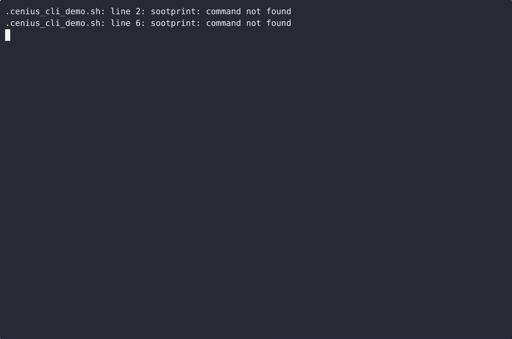

# Sootprint — complete Full-stack app command-line tool example app

**Sootprint** is a free, open-source command-line tool written in Full-stack app. Sootprint is a single-file, standard-library-only Python 3 CLI that lets a householder or sweep log chimney sweep visits, print a text chart of flue condition over time, and get a heuristic 0-100 creosote risk score w…. Every Sootprint file — code, design, seeded demo data — ships in this repository under the Apache-2.0 license. Self-host it, or [remix Sootprint on cenius.ai](https://cenius.ai/marketplace/p/sootprint?ref=gh&utm_campaign=sootprint-webapp) to get a custom build with full rebrand rights.


[](LICENSE)  [](https://cenius.ai)

[](https://cenius.ai/marketplace/p/sootprint?ref=gh&utm_campaign=sootprint-webapp)

> **▶ [Open & edit in cenius.ai](https://cenius.ai/marketplace/p/sootprint?ref=gh&utm_campaign=sootprint-webapp)** — one click to an editable workspace: describe changes in plain English, get an instant preview, one-click deploy and host. Modifications made on the platform come with full rebrand & relicense rights.

_Local clone? See [Quick start](#quick-start) below. cenius.ai is the zero-setup path._

## Demo


▶ **[Video walkthrough](https://cenius.ai/marketplace/p/sootprint?ref=gh&utm_campaign=sootprint-webapp)** — see the app in action on the cenius.ai project page · [MP4 file](.github/media/demo.mp4)

## Screenshots



## Quick start

```bash
./install.sh   # installs dependencies + seeds demo data
```

See [`INSTALL.md`](INSTALL.md) for full setup and usage instructions.

## Usage guide

Walkthroughs of the four commands that actually exist, with the output they
actually print. The log used below is the nine-sweep sample in
[`examples/sweeps.json`](../examples/sweeps.json); the first three sweeps are
used for the short examples so the output stays readable.

```bash
export SOOTPRINT_HOME="$PWD/examples"   # optional: use the bundled sample log
```

---

### `sootprint add` — log a sweep

Records one sweep visit. The date must be ISO-8601 (`YYYY-MM-DD`) and the flue
condition a whole number from 1 to 5; `--flue` and `--notes` are optional.

```console
$ sootprint add --date 2024-01-15 --condition 2 --flue "main flue" \
      --notes "heavy soot on the smoke shelf"
Logged sweep on 2024-01-15 (condition 2/5).
```

```console
$ sootprint add --date 2024-05-01 --condition 4
Logged sweep on 2024-05-01 (condition 4/5).
```

* The sweep is visible in `sootprint list` immediately afterwards.
* One line of confirmation goes to stdout and nothing else, so it is safe to
  call from a script or a cron entry.
* `--flue` defaults to `main flue`; `--notes` defaults to empty.
* Both free-text fields are single-line: runs of whitespace are collapsed to
  single spaces, so a log row can never be broken across lines.

#### When the input is bad, nothing is written

The error goes to **stderr**, stdout stays empty, the exit status is **2**, and
`sweeps.json` is not created or modified.

```console
$ sootprint add --date 15/01/2024 --condition 4
sootprint: error: the date must be ISO-8601 (YYYY-MM-DD), for example 2024-05-01; got '15/01/2024'.
$ echo $?
2
```

_Full guide: [`USAGE.md`](USAGE.md)_

## Features

- Chimney sweep log
- Flue condition chart
- Creosote risk score

## Architecture

Folder layout: `examples/`, `tests/`. `install.sh` provisions dependencies and seeds demo data so the app starts with something real to explore. Built in Full-stack app (13 files). See [`INSTALL.md`](INSTALL.md) for complete setup instructions.

## FAQ

### How do I run Sootprint on my own server?

Everything you need ships in this repo: clone it, run `./install.sh` to install dependencies and seed demo data, then follow [`INSTALL.md`](INSTALL.md) to start it. No external services required.

### Is it possible to white-label Sootprint for a client?

Yes — and the easiest way is [remixing it on cenius.ai](https://cenius.ai/marketplace/p/sootprint?ref=gh&utm_campaign=sootprint-webapp): modifications made on the platform come with full rebrand and relicense rights over your derivative.

### Which framework or language does Sootprint use?

Sootprint is a Full-stack app application — and this repository holds the complete, runnable source, not a stripped-down sample. Highlights include chimney sweep log.

### Is Sootprint editable without a developer?

Open it on [cenius.ai](https://cenius.ai/marketplace/p/sootprint?ref=gh&utm_campaign=sootprint-webapp) and describe the changes you want in plain English — the platform modifies the app and gives you a new, downloadable build.

### Can I build a business on Sootprint?

The code is under the Apache-2.0 license, which allows commercial use without restriction. You can build, sell, and deploy it freely. Full text: [LICENSE](LICENSE).

## License & rebranding

Released under the [Apache License 2.0](LICENSE) (© 2026 Cenius AI) — free for personal and commercial use. The Cenius name/logo are trademarks (see NOTICE).

**Need a customized version?** [Remix this app on cenius.ai](https://cenius.ai/marketplace/p/sootprint?ref=gh&utm_campaign=sootprint-webapp) — modifications made on the platform come with **full rebrand & relicense rights** over your derivative.

## Built with cenius.ai

This entire application — code, design, seeded demo data — was generated on **[cenius.ai](https://cenius.ai)** from a plain-English description.

- 🚀 [Build your own app on cenius.ai](https://cenius.ai)
- 🎛️ [Remix Sootprint on the marketplace](https://cenius.ai/marketplace/p/sootprint?ref=gh&utm_campaign=sootprint-webapp) — open it in a workspace, prompt for changes, and ship your own version.

More open-source apps: [the Cenius-ai catalog](https://github.com/Cenius-ai) · [showcase index](https://github.com/Cenius-ai/showcase)
